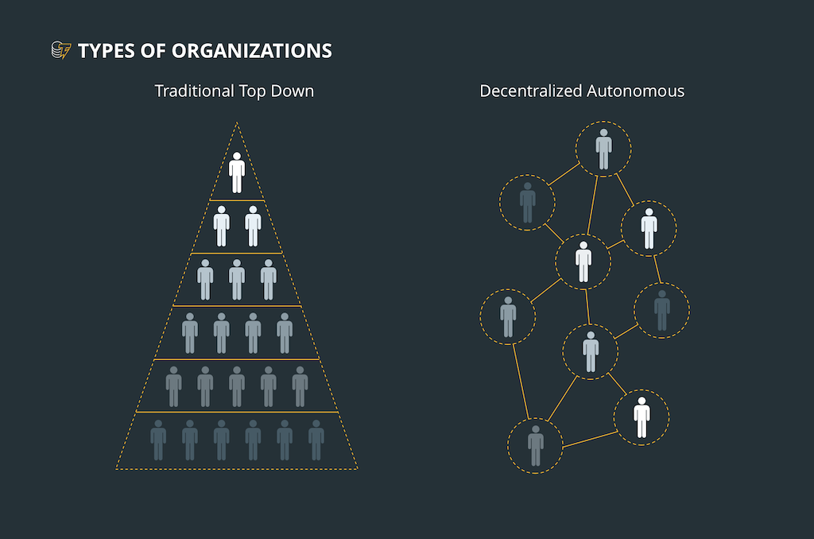

# DAO란 무엇이며 어떻게 작동하는가?
## DAO란?
  - 우리에게서 돈을 받아서 그 대가로 스낵을 줄 뿐만 아니라 그 돈으로 상품을 자동적으로 재주문하는 자동판매기가 있다고 상상해보자  
  - 이 기계는 혼자서 청소 서비스도 주문하고 자신의 임대료도 지불한다  
  - 게다가, 우리와 그 밖의 다른 사용자들이 이 기계에 돈을 넣으면 그것이 어떤 스낵을 주문해야 하며 얼마나 자주 청소되어야 할지에 대한 발언권을
  가지게 된다.
  - 이 기계는 관리자가 없으며, 이 모든 과정은 사전에 코드로 작성된다
  - 이것이 DAO, 즉 탈중앙화된 자율조직의 대략적인 작동방법
  - DAO의 주된 아이디어 역시 계층구조적인 관리 없이 완전한 기능이 가능한 회사나 조직을 설립하는 것

## DAO의 작동 방법
- 처음에는 비트코인이 사상 최초의 완전한 기능을 갖춘 DAO로 간주
  - 사전 프로그램 된 일련의 규칙을 갖추고 있고, 자율적으로 기능하며, 분산 합의 프로토콜을 통해 조정되기 때문
  - 그 이후로 이더리움 플랫폼에서 스마트 컨트랙트를 사용할 수 있게 되면서 DAO의 생성은 일반 대중에게 보다 가까워졌으며 현재의 모습을 갖춤
- DAO의 완전환 작동을 위해 필요한 것은 무엇일까?
  - 작동을 위해 따라야 할 일련의 규칙이 필요하다.
    - 이러한 규칙들은 스마트 컨트랙트로 인코딩 되는데, 이는 본질적으로 컴퓨터 프로그램으로서 인터넷 상에 자율적으로 존재하지만,
    - 스스로는 할 수 없는 일을 사람들이 수행해줘야 함
  - 규칙이 정해지고 나면 DAO는 자금 조달 단계로 들어간다.
    1. 첫째, DAO는 일종의 내부 자산, 즉 조직에서 지출하거나 조직 내의 특정 활동에 대한 보상으로 사용할 수 있는 토큰이 있어야함
    2. 둘째, 사용자는 DAO에 투자함으로써 투표권을 갖게 되며, 이를 통해 그 운영 방식에 영향을 미칠 수 있게 됨
  - 자금조달 기간이 끝나고 DAO가 배치되면 완전 자율화 되며, 그 개발자는 물론 그 밖의 어느 누구로부터도 완전히 독립적이 된다.
    - 오픈 소스이므로 그 코드는 누구라도 볼 수 있음
    - 모든 규칙과 금융 거래는 블록체인에 기록
    - DAO는 완전히 투명하고 변경 불가능하며 부패될 수 없음
  - DAO가 가동되면 그 자금의 사용처와 방법에 대한 모든 결정은 합의를 통해 이루어진다.
    - DAO의 지분을 구매한 모든 이들이 그 미래에 관하여 제안할 수 있음
    - 네트워크가 제안으로 넘쳐나는 것을 막기 위해, 제안을 하려면 예금을 해야 할 수 있음
  - 이해관계자들이 이 제안에 대해 투표한다.
    - 어떤 조지츨 취하기 위해서는 과반수가 이에 동의해야 함
    - 이러한 과반수에 도달하기 위해 필요한 비율은 DAO에 따라 다를 수 있는데, 이는 DAO의 코드에 명시될 수 있음##

## DAO의 주주가 되는 방법과 이유
  - DAO에 투자하기는 비교적 쉬움
    - 이더나 비트코인의 구매 방법과 비슷
  - 자금 조달 단계가 끝나고 나면 제안을 할 수 있을 뿐만 아니라 이에 대한 투표도 할 수 있고 어쩌면 수익까지 올릴 수 도 있음
  - 구매한 토큰의 양이 자신에게 주어지는 투표권의 크기와 상관관계를 갖게 됨

## Dapp이란?
 - Dapp, 탈 중앙화 애플리케이션 (Decentralized Applications)은 본질적으로 제지 불가능한 앱
 - 이더리움 블록체인에서 작동하며 스마트 컨트랙트에 의해 구동
 - 일반 앱과의 주된 차이점은 완전히 자율적이어서 중개자의 활동이 필요 없고 기본적으로 검열의 영향을 받지 않는다는 점
 - 사용자와 서비스를 직접 연결시켜주는 것

## The DAO 해킹 사건
  - 'The DAO'는 특정 DAO의 이름으로서, 독일의 스타트업 slock.it의 설립 팀에 의해 개발
  - slock.it의 전문 분야인 '스마트 록'은 사람들이 탈중앙화 버젼의 에어비앤비에서 자신들의 부동산을 공유하도록 해줌
  - The DAO의 코드는 완벽하지 않았음 : 오픈 소스로서 누구라도 볼 수 있었기 때문에 누군가가 악용할 수 있는 버그를 발견
  - 6월 17일에 익명의 해커 또는 해커 집단이 The DAO로부터 그 구조를 그대로 복사한 '자식 DAO'로 돈을 빼돌리기 시작함
  - 자금 유출이 중단될때까지 이 해커는 5,000만 달러 상당이 넘는 이더를 훔쳐냈음
  - 이 사건으로 인해 호스팅 플랫폼으로서의 이더리움 평판과 DAO의 개념 자체가 심각하게 손상
    - 이더리움 네트워크마저 둘로 나눠지게 됨
    - DAO의 잠재적인 약점은 물론, 두말할 필요도 없이 향후의 DAO에서는 그러한 약점들이 고려될 것임을 보여줌

## DAO의 장점
  - DAO의 개념 자체가 매우 흥미진진하다는 점에는 의심의 여지가 없음
  - DAO는 오늘날의 조직들이 운영되는 방식에서 잘못된 모든 점을 해결하려 하고 있기 때문임
  - 완벽하게 구조화된 DAO는 모든 투자자들에게 조직을 구성할 기회를 제공
  - 계층 구조가 없으므로 모든 혁신적인 아이디어를 누구라도 제안할 수 있으며, 조직 전체가 이를 고려할 수 있음
  - 투자자는 제안을 하고 이에 대해 투표하려면 일정 금액의 돈을 써야하므로, 자신들의 결정을 평가해 효과적이지 못한 해결책에
    시간 낭비를 하지않도록 노력하게 됨
  - 모든 규칙은 물론 모든 금융 거래 하나하나까지 블록체인에 기록되기 때문에 DAO는 완전히 투명

## 단점과 비판
  - DAO는 암호화폐와 관련된 거의 모든 것들과 마찬가지로 극히 새롭고 어느 정도 혁명적인 기술
    - 이러한 프로젝트에는 당연히 많은 비판이 따르기 마련
  - The DAO의 해킹 사태 이후로 가장 시급한 문제는 보안상의 문제 -> '제지 불가능한 코드'
    - 해커들이 공격하는 동안에 목격자들과 투자자들은 The DAO에서 자금이 빠져나가는 것을 속수무책으로 지켜보면서도 아무것도 할 수가 없었음
    - 물론, 코드가 잘 짜여있고 버그가 없다면 이러한 공격은 피할 수 있을 것

## DAO의 사례
  - DASH : 오픈 소스의 P2P 암호화폐로서, 즉각적인 결제와 사적 거래를 제공
  - Digix Global : 2P 디지털 자산의 금본위제. Digix Gold 토큰 하나는 LMBA 표준 금 1그램에 해당되며, 세이프하우스(Safehouse)의 금고에 안전하게 보관
  - BitShares : 탈중앙화 암호화폐 거래소로서, 빠르고 유연한 거래 플랫폼으로 홍보하고 있으며, 암호화폐의 자유와 달러화의 안정성을 함께 제공

