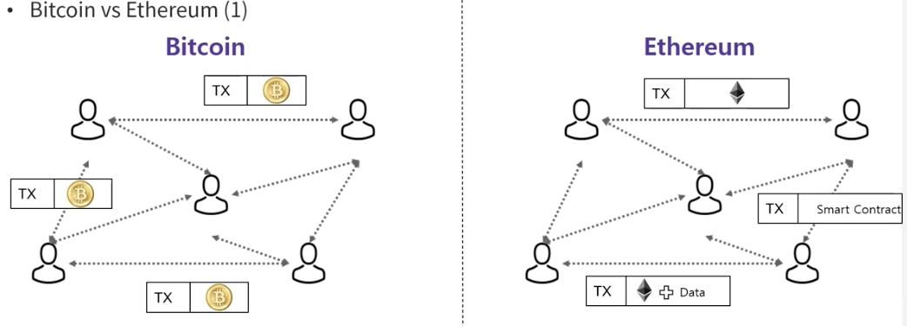

# Chapter 1. 이더리움이란 무엇인가?
- 이더리움 : 스마트 컨트랙트라는 프로그램을 실행하는 오픈 소스에 기반을 둔, 전 세계에 걸쳐 탈중앙화된 Computing Infrastructure
- 비트코인 vs 이더리움  
  비트코인은 제한된 스크립트 언어를 사용, 그러나 이더리움은 임의성과 무한 복잡성을 가진 코드를 실행할 수 있는 가상 머신을 운영하는
  범용프로그램이 가능한 블록체인으로 설계됨
  - 차이점 1 - Smart Contract
    - 이더리움의 개발자 비탈릭 부테린은 거래 내역을 저장하는 회계장부 형식의 비트코인보다 블록에 더 많은, 더 다양한 내용을 저장하길 원함
    - 거래내역 뿐 아닌 원하는 모든 내용, 정확히는 프로그래밍 코드를 삽입할 수 있는 형태를 구상
    - 이더리움은 프로그래밍 한대로 동작하는 Smart Contract를 실행시키는 분산 컴퓨팅 플랫폼으로 탄생
    - 1세대 블록체인인 비트코인에서는 없었던 smart contract라는 기능을 통해 분산 Application을 제작 할 수 있는 이더리움과 같은 코인들을 2세대 블록체인이라고 부르며, 이후 많은 블록체인 프로젝트들이 이더리움을 모티브로 개발
    - 
    - 비트코인은 금융에 특화되어 화폐 기능을 하는데 초점을 맞추고 있는 플랫폼
    - 비트코인에 저장되는 정보는 참가자들이 만들어내는 거래에는 BTC를 보내고 받는 내용 뿐
    - 이더리움에는 블록체인에 암호화폐인 이더뿐만 아니라 Smart Contract도 저장될 수 있음
    - 오른쪽 그림을 보면 참가자들이 만들어내는 거래에 암호화폐인 이더뿐만 아니라 Smart Contract와 Smart Contract을 이용하기 위한 데이터 등 다양항 정보들이 포함되어 전달
    - 이더리움은 블록에 데이터 뿐만 아니라 smart contract에서 조건문, 반복문 등의 실행코들 포함시켜 저장할 수 있음
      - 거래중, 입금확인, 거래완료 등등의 상태로 더 세분화하여 정보를 저장 (비트코인 경우 사용 or 사용안함의 두가지 상태로만 표현)
  - 차이점 2 - 계정 기반 설계
    - 비트코인은 계정기반으로 설계되어있지 않기 때문에, 사용자는 비트코인 주소만 가지고 있고, 사용자에 대한 어떤 정보도 블록체인에 저장되지 않음
    - 1
- 이더리움 구성요소
  - P2P Network : 이더리움은 이더리움 메인 네트워크에서 실행됨
  - 합의 규칙 : 이더리움의 합의 규칙은 Yellow Paper(https://pow-project.tistory.com/45)에 정의되어 있음 ( https://ethereum.github.io/yellowpaper/paper.pdf )
  - Transaction : 이더리움 Transaction은 보낸 사람, 받는 사람, 값, 데이터 페이로드가 포함된 네트워크 메시지
  - 상태 머신 : 이더리움 상태 전이는 바이트코드를 실행하는 스택 기반 가상머신인 EVM에 의해 처리, 
               Smart Contract도 EVM 프로그램 중 하나
  - 
